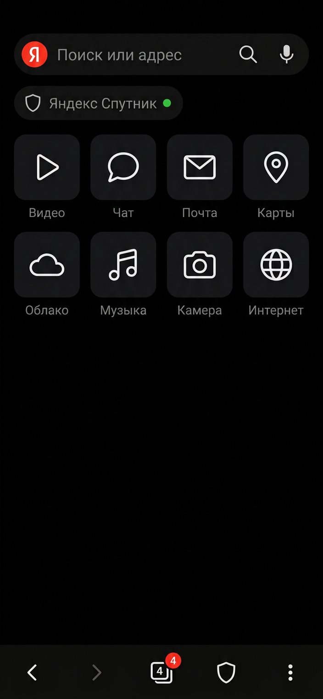

# Яндекс Браузер для Android

Полноценный браузер на **настоящем браузерном движке Gecko** (GeckoView 155 · Gecko + SpiderMonkey + WebRender) —
**без Android WebView**. Jetpack Compose UI, тёмная флэт-тема, режим максимальной экономии трафика
включён по умолчанию, вкладки и сайты живут в фоне и **не перезагружаются**.

<p align="center">
  
</p>

---

## Чем это не WebView

Android WebView — это системный компонент, который обновляет Google, и он жёстко привязан к политике
платформы. Мы его не используем вообще. Вместо этого в APK встроен **собственный движок GeckoView**:

| Что | Технология |
|---|---|
| Рендеринг | Gecko + WebRender (GPU-композитинг) |
| JavaScript | SpiderMonkey (JIT) |
| Стили | Quantum CSS / Stylo (многопоточный) |
| Процессы | Fission: сайты изолированы друг от друга |
| Расширения | Поддержка WebExtensions (используется для блокировки и тёмной темы) |
| Приватность | Enhanced Tracking Protection, Global Privacy Control, Safe Browsing |

Именно поэтому браузер умеет то, чего у WebView-оболочек нет: блокировка контента на уровне
движка, форс-дark без сторонних библиотек, приватные вкладки с отдельным куки-контекстом,
сохранение и восстановление состояния сессии.

---

## Ключевые возможности

### 🚀 Максимальная экономия трафика (включена по умолчанию)
- **STRICT-блокировка** рекламы, трекеров, аналитики, фингерпринтинга и криптомайнинга на уровне движка.
- **Сторонние cookie режутся** (остаются только первопартийные — логины работают, трекинг нет).
- **Веб-шрифты отключены** — минус десятки-сотни килобайт на каждой странице.
- **Встроенное WebExtension-расширение** с собственным списком рекламных доменов рунета и мира:
  реклама не скачивается вообще (а не «скачивается и скрывается»).
- **Query-parameter stripping** — вырезает мусорные трекинговые параметры из ссылок.
- Счётчик экономии в реальном времени: сколько запросов заблокировано и сколько байт сэкономлено.

### 🌙 Тёмная тема везде
- Интерфейс — чистый чёрный (AMOLED), флэт, без градиентов и теней.
- Сайтам сообщается `prefers-color-scheme: dark` → **все сайты с тёмной темой сразу открываются тёмными**.
- Сайты **без** своей тёмной темы принудительно затемняются встроенным расширением (инверсия
  с сохранением цветов картинок и видео).

### ♾️ Фоновая работа — главная фишка
- Вкладки — это постоянные `GeckoSession`, они **не закрываются** при уходе из приложения.
- Foreground-сервис с уведомлением держит процесс и движок живыми (Android не убивает).
- `SessionState` сохраняется на диск: даже если система выгрузит процесс, вкладки восстановятся
  **без перезагрузки страницы** — с историей, скроллом и формами.
- Вернулись в браузер → страница там же, где вы её оставили.

### 🧩 Полноценный набор браузера
- Вкладки: обычные и приватные, сетка со счётчиком, закрытие всех.
- Адресная строка: Яндекс по умолчанию (+ Google, Bing, DuckDuckGo), подсказки из истории и закладок.
- Закладки, история, загрузки (через системный DownloadManager).
- Поиск по странице средствами движка, голосовой поиск (системный распознаватель).
- Версия для ПК, шэринг, копирование ссылки, очистка кэша/cookie/всех данных.
- Быстрый доступ: сетка 4×2 с реальными фавиконками сайтов.

---

## Сборка

### Через GitHub Actions (рекомендуется)
Workflow `.github/workflows/android-release.yml` собирает релизные APK под каждую архитектуру:

```
Actions → Build & Release APK → Run workflow
```

Артефакты: `app-arm64-v8a-release.apk` (для современных телефонов), `app-armeabi-v7a-release.apk`,
`app-x86_64-release.apk` (эмулятор).

Чтобы APK можно было ставить обновлением поверх предыдущих версий, добавьте секреты репозитория:
`ANDROID_KEYSTORE_BASE64` (keystore в base64), `ANDROID_KEYSTORE_PASSWORD`, `ANDROID_KEY_ALIAS`,
`ANDROID_KEY_PASSWORD`. Без них workflow создаст временный ключ и предупредит об этом.

### Локально
```bash
# Нужен JDK 17 и Android SDK (compileSdk 36)
export KEYSTORE_FILE=/path/to/release.jks
export KEYSTORE_PASSWORD=...
export KEY_ALIAS=...
export KEY_PASSWORD=...
./gradlew :app:assembleRelease
```

Результат: `app/build/outputs/apk/release/`.

---

## Размер APK и оптимизации

- **R8** (полная обфускация + удаление мёртвого кода) и **shrinkResources**.
- Раздельные APK по ABI — каждый содержит только нативный движок своей архитектуры.
- Только ресурсы `ru` + `en`.
- Никаких лишних библиотек: свои иконки (~30 кастомных векторов вместо `material-icons-extended`),
  свой загрузчик фавиконок с дисковым кэшем (вместо Coil/Glide), свой тост и шторка меню.

Основной вес APK — это сам движок Gecko (~80–100 МБ на arm64). Это плата за то, что браузер
не зависит от системного WebView и работает на собственном движке.

---

## Архитектура

```
app/src/main/java/ru/yandex/browser/mobile/
├── YandexBrowserApp.kt          # Application: старт движка и менеджера вкладок
├── core/
│   ├── BrowserEngine.kt         # GeckoRuntime: ContentBlocking, тёмная тема, расширение, данные
│   ├── TabManager.kt            # вкладки = GeckoSession, персистентность SessionState, делегаты
│   ├── KeepAliveService.kt      # foreground-сервис фонового режима + уведомление
│   ├── Settings.kt              # настройки, закладки, история, плитки (Compose-состояние)
│   ├── Search.kt                # поисковики, разбор адреса/запроса, фавиконки
│   └── TrafficStats.kt          # счётчики блокировок и сэкономленных байт
├── web/
│   └── BrowserView.kt           # GeckoView в Compose + кэш фавиконок
└── ui/
    ├── MainActivity.kt          # единая Activity, edge-to-edge
    ├── BrowserApp.kt            # общий каркас, меню, оверлеи
    ├── BrowserChrome.kt         # адресная строка, чип экономии, нижняя панель
    ├── HomeScreen.kt            # быстрый доступ, статистика, частые сайты
    ├── Panels.kt                # адресная строка-оверлей, вкладки, меню, поиск по странице
    ├── Screens.kt               # настройки, закладки, история
    ├── icons/BIcons.kt          # собственный набор минималистичных иконок
    └── theme/Theme.kt           # флэт-палитра (чёрный + красный акцент)

app/src/main/assets/extensions/yandex-assistant/
├── manifest.json                # MV2 WebExtension
├── blocklist.js                 # список рекламных/трекинговых доменов
├── background.js                # блокировка webRequest + связь с приложением
└── darkmode.js                  # принудительная тёмная тема для сайтов без неё
```

Подробнее о решениях — в [docs/ARCHITECTURE.md](docs/ARCHITECTURE.md).

---

## Технологический стек

| Компонент | Версия |
|---|---|
| Движок | GeckoView `155.0.20260903215306` (Gecko + SpiderMonkey + WebRender) |
| Android Gradle Plugin | 8.13.2 |
| Gradle | 8.13 |
| Kotlin | 2.4.10 |
| compileSdk / targetSdk | 36 |
| minSdk | 26 (Android 8.0) |
| UI | Jetpack Compose (BOM 2026.09.00) |

---

## Что дальше (roadmap)

- [ ] Обработка запросов разрешений (камера/микрофон/геолокация) с диалогами.
- [ ] Синхронизация закладок и открытых вкладок между устройствами.
- [ ] Скачивание с куками и докачкой внутри браузера.
- [ ] Настраиваемый список блокировки и белый список сайтов.
- [ ] Жесты: свайп между вкладками, pull-to-refresh.

---

## Лицензия и брендинг

- Код приложения — свободно используйте и меняйте как угодно.
- **GeckoView распространяется под MPL-2.0** (Mozilla) — при распространении сборки нужно сохранять
  уведомления лицензии движка.
- Бренд «Яндекс» и логотип «Я» — собственность Яндекс. В проекте они используются как
  визуальный стиль по запросу заказчика; **перед публикацией в Google Play/сторы замените брендинг
  на свой** (это одна строка `app_name` и одна иконка) либо получите разрешение правообладателя.
- В настройках браузера поисковой системой по умолчанию выбран Яндекс.
